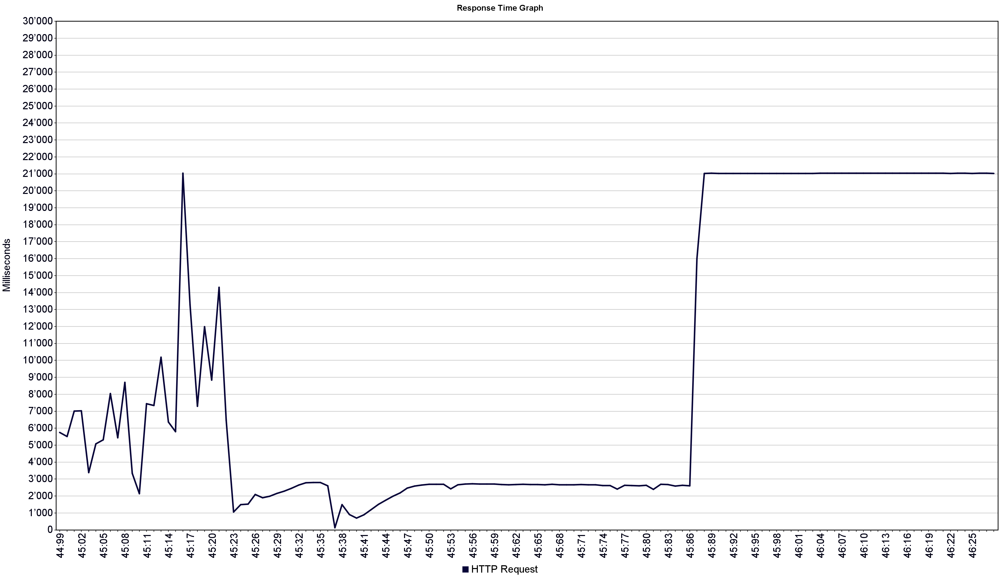
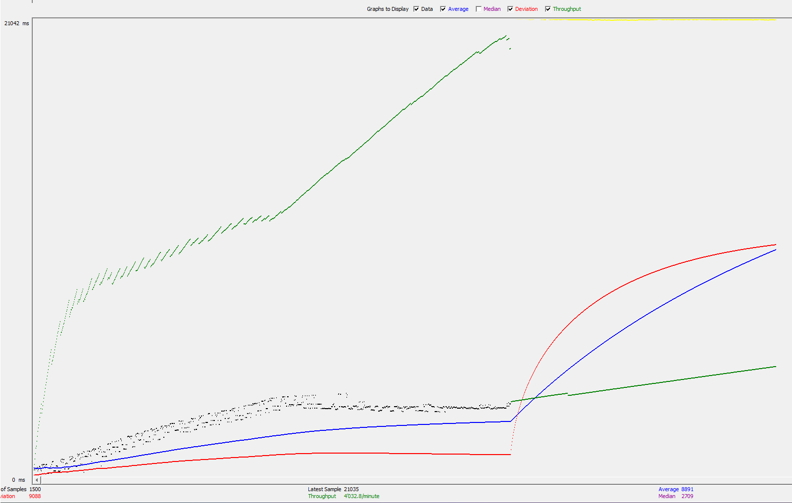
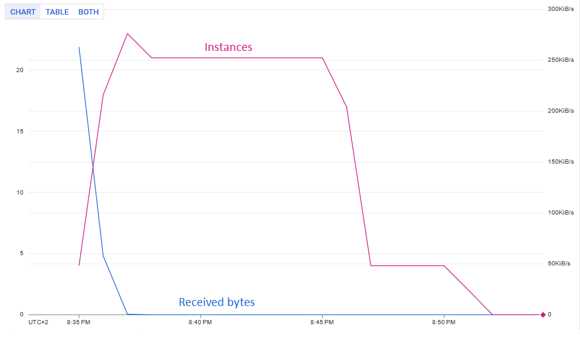

# CLD - LAB04 : Google App Engine

**Group R : A. David, T. Van Hove**

**Date : 04.05.2023**

**Teacher : Prof. Marcel Graf**

**Assistant : Rémi Poulard**


In this lab we will deploy a simple web application on the Google App Engine, then add the capability to store data in the Google Datastore to it. Finally we will conduct performance tests and discuss it.


### Table of content

[toc]

# Task 1 : Deployment of a simple web application

> Deliverable: What does the sample code generated by the wizard do? Explain what you see in the **Java class files**, **web.xml**, **appengine-web.xml** and **index.jsp** files in a few sentences.

HelloAppEngine.java: Java Servlet, which is a Java class that extends the functionality of a server. The code receives HTTP requests from clients, processes them, and returns an HTTP response. The Servlet is responsible for handling the logic of our application by listening HTTP GET requests at the "/hello" endpoint and sends a request to the "/hello" endpoint. When the `doGet` method is called, the servlet retrieves system properties, sets the content type of the response to plain text, and writes a response message containing the App Engine version, Java specification version. The response message is then sent back to the client as plain text.

web.xml: Also known as the deployment descriptor, it's an XML configuration file for Java web applications. It contains information about the application's servlets, filters, listeners, context parameters, and other configurations. The web.xml file is used by the server to deploy and configure the application. The `<welcome-file-list>` specifies the default file to be served when a client requests a directory without specifying a file.

appengine-web.xml: This file configures App Engine-specific settings like application ID, version, and runtime. It helps manage resources and indicates if the app is thread-safe (`<threadsafe>` element). The `<runtime>` element sets the environment (e.g., Java 8), and the `<property>` element defines the logging configuration file location, such as `WEB-INF/logging.properties`.

index.jsp: This file is a JavaServer Pages file that allows embedding Java code within HTML to create dynamic web pages. When a client requests the application's root URL without specifying a particular file, the server will look for a "welcome file" specified in web.xml, which is usually index.jsp.


# Task 2 : Develop a servlet that uses the datastore

> Deliverables:
>
> - Copy the Servlet into the report.
> - Copy a screenshot of the local and the App Engine console with the Datastore Viewer.


Here is the code of our DatastoreWrite servlet:

````java
package ch.heigvd.cld.lab;

import com.google.appengine.api.datastore.DatastoreService;
import com.google.appengine.api.datastore.DatastoreServiceFactory;
import com.google.appengine.api.datastore.Entity;
import com.google.gson.Gson;
import com.google.gson.JsonObject;

import javax.servlet.annotation.WebServlet;
import javax.servlet.http.HttpServlet;
import javax.servlet.http.HttpServletRequest;
import javax.servlet.http.HttpServletResponse;
import java.io.IOException;
import java.util.Enumeration;

/**
 * Writes a key-value pair in the Google datastore based on the GET request parameters
 * Returns the written pair as a JSON object as a response
 *
 * @author Anthony David
 */
@WebServlet(name = "DatastoreWrite", value = "/datastorewrite")
public class DatastoreWrite extends HttpServlet {

    private static final DatastoreService DATASTORE = DatastoreServiceFactory.getDatastoreService();
    private static final Gson GSON = new Gson();

    @Override
    protected void doGet(HttpServletRequest req, HttpServletResponse resp) throws IOException {

        // Get the _kind and _key parameters from the request
        String kind = req.getParameter("_kind");
        String key = req.getParameter("_key");

        // Check if _kind parameter is present
        if (kind == null) {
            resp.sendError(HttpServletResponse.SC_BAD_REQUEST, "Missing _kind parameter.");
            return;
        }

        // Create an Entity instance for the given kind and key
        Entity entity = key == null ? new Entity(kind) : new Entity(kind, key);

        // Iterate over all the parameters in the request, and add them to the entity
        Enumeration<String> parameterNames = req.getParameterNames();
        while (parameterNames.hasMoreElements()) {
            String paramName = parameterNames.nextElement();

            if (!paramName.equals("_kind") && !paramName.equals("_key")) {
                String paramValue = req.getParameter(paramName);
                entity.setProperty(paramName, paramValue);
            }
        }

        // Add the entity to the Datastore
        DATASTORE.put(entity);

        // Return the added entity data as a JSON object to be displayed in the page
        JsonObject response = new JsonObject();
        response.addProperty("kind", entity.getKind());
        response.addProperty("key", entity.getKey().getName());
        response.add("properties", GSON.toJsonTree(entity.getProperties()));

        resp.setContentType("application/json");
        resp.getWriter().println(GSON.toJson(response));
    }
}

````

This servlet listens for incoming HTTP GET requests at the "/datastorewrite" endpoint. When a GET request is received, the servlet does the following:

1. Retrieves the `_kind` and `_key` parameters from the request.
2. Validates that the `_kind` parameter is present.
3. Creates a new Entity instance with the specified kind and key.
4. Iterates over all the other request parameters and adds them as properties to the Entity.
5. Stores the Entity in Google Datastore.
6. Constructs a JSON object containing the kind, key, and properties of the stored Entity.
7. Sets the response content type to "application/json" and sends the JSON object back to the client.


Note that for the sake of our tests with jmeter, we had to change the response `HttpServletResponse.SC_BAD_REQUEST` by `HttpServletResponse.SC_OK`. 

Here are the screenshots of the local and App Engine Datastore viewer:


## Going further

We aimed to make our web app more user-friendly and visually appealing. To do this, we enhanced our main page (index.jsp) and added a form to send elements directly to the datastore within the web app. When an element is added to the datastore, we notify the user about the most recently added element using the Fetch API. While we may have spent a large amount of time on this, it was fun!


Link to our app: https://20230502t213614-dot-grr-vanhove.ew.r.appspot.com/

Check our code on [github](https://github.com/DrC0okie/HEIG_CLD_Labo4).


# Task 3 : Test the performance of datastore writes

> Deliverables:
>
> - For each performance test copy a screenshot of the JMeter **Graph Results** listener and the App Engine **Dashboard** view into the report.
> - What response times do you observe in the test tool for each Servlet?
> - Compare the response times shown by the test tool and the App Engine console. Explain the difference.


The following tests were conducted using JMeter 5.5. For the burst tests, we sent 1,500 requests to the App Engine server with a ramp-up period of 1 second. For each test category (burst and constant load), the first test involved sending requests to the servlet without providing any parameters in the URL, so no data was written to the datastore. The second test involved sending requests with the following parameters: `?_kind=test&_value=test`. This action writes data into the Google datastore. We waited for the active instances to be around 0 before launching the second test for greater consistency. The goal of these two test categories was to observe whether writing to the datastore has an impact on performance or not in two different scenarios.

## Burst tests

The first tests involved sending a request burst (1,500 requests) to see how the App Engine can scale to handle this high volume.

### Not writing in the datastore

In this test, we did not write data to the Google datastore.

#### JMeter data

As seen in the two charts below, after a certain number of requests, the server is unable to respond to them. We reach the threshold where we experience request timeouts. In the graph result, we can observe that the median response time is `2,709 ms`, with an average of `8,891 ms`.






#### Google dashboard data

On the Google side, we have significantly less granularity and control compared to JMeter. However, we can clearly see that the instance creation increases within a short delay in response to incoming traffic. We can observe that 10 instances have been created to handle the load. Additionally, the latency graph appears smoother than the JMeter one because the sampling rate is only 1 minute, and we cannot change that. As a result, the graph seems to indicate that the peak latency is 4 seconds, when in reality, that may not be the case.


### Writing in the datastore

In this test we write in the Google datastore with those parameters in the url : `?_kind=test&_value=test`

#### jmeter data

In the jmeter side, we can see that this time the median latency is `3590 ms` and the average latency is `9730 ms` so respectively `32%` and `9%` more than the previous test. Again, like the previous test, we hit a threshold were the receive request time-outs.


#### Google dashboard data

On the google side, we can observe that, this time, 12 instances have been created, and that latency seems to be reaching 6 seconds, so 20% more instances and 50% more latency. However, like the previous tests, we must emphasis that The Google metrics cannot be taken as precise measure as the sampling rate is only 1 minute.


## Constant load test

Those 2 tests have been done with a constant load of 50 threads for 1000 loops with different users for each iteration. It is important to note that for those tests it is useless to show the jmeter results graph because with 50'000 requests the graph is `unreadable`. Instead we will append an aggregate report as a table.


### Not writing in the datastore

#### jmeter data

As we can see in the graph and the table below, using a constant load with less users gives us much more consistent results because we do not hit the threshold where the requests time-out. Thus the average latency is much lower than the burst tests with a median of `40 ms` and an average of `58 ms`.


| Samples | Average | Median | Min   | Max     | Error | Throughput  | Test duration |
| ------- | ------- | ------ | ----- | ------- | ----- | ----------- | ------------- |
| 50'000  | 58 ms   | 40 ms  | 27 ms | 4178 ms | 0%    | 768.2 req/s | 1 min 4 sec   |


#### Google dashboard data

On the Google side, we can see, again that the instance creation takes place within a delay after the incoming traffic. In this test, 23 instances have been created. Exaclty like in the burst tests, we can see that the latency and received bytes metrics are smoothed as the sampling rate is only 1 minute.

The mesured latency is `135 ms` .





### Writing in the datastore

#### jmeter data

By writing in the Google datastore, we can observe that the median latency is `70 ms` and the average latency is `114 ms`. This is respectively a 96% and 75% more latency than the previous test.


| Samples | Average | Median | Min   | Max     | Error | Throughput  | Duration    |
| ------- | ------- | ------ | ----- | ------- | ----- | ----------- | ----------- |
| 50'000  | 114 ms  | 70 ms  | 47 ms | 5538 ms | 0%    | 411.2 req/s | 2 min 1 sec |


#### Google dashboard data

On the Google side, we can see that `33` instances have been created, so an increase of `43%` compared with the previous test. The measured latency is `233 ms`, so an increase of `72%` compared to the previous test.


## Tests conclusion

The main limiting factor of this analysis is the lack of granularity and control in Google Metrics Explorer. The first problem is the sample rate. When conducting a burst test or a constant load test to evaluate the service capability, as we did, we do not have enough data points to properly assess performance.

The second problem is the lack of control over the graphical interface in Google Metrics Explorer. In fact, we cannot export a graph as an image, change the graph's font size, line width, or even line colors! This results in unreadable graphs or, at best, necessitates editing a screenshot, as we did, and losing a significant amount of time. One solution would be to download the CSV data and plot it in Excel, but we did not have the time to do so. On the other hand, JMeter allows much greater control over reports and graphs.

However, in the tests we conducted, we were able to systematically observe an increase in latency and the number of created instances when writing to the datastore:

**Burst tests**

| Increase latency - google | Increase median latency - jmeter | Increase instance count |
| ------------------------- | -------------------------------- | ----------------------- |
| 50%                       | 32%                              | 20%                     |

**Constant load tests**

| Increase latency - google | Increase median latency - jmeter | Increase instance count |
| ------------------------- | -------------------------------- | ----------------------- |
| 72%                       | 96%                              | 43%                     |


## Quotas

> How much resources have you used running these tests? From the **Quota Details** view of the console determine the non-zero resource quotas (**Daily quota** different from 0%). Explain each with a sentence.  To get a sense of everything that is measured click on **Show resources not in use**.


So for our tests we sent 373'022 requests to the servlet. Apparently the incoming bandwidth is 3 times greater than the outgoing bandwidth. This may be due to the caching capabilities of the server.

Unfortunately for us, when we wanted to take the storage resource screenshot, the quota page has been reset (apparently the quotas are reset every 24 hours). So we cannot show any quotas about the storage resources.


## Broken algorithm question

> Let's suppose you become suspicious that the algorithm for the automatic scaling of instances is not working correctly. Imagine a way in which the algorithm could be broken. Which measures shown in the console would you use to detect this failure?

We would monitor `CPU utilization`, `Error rate`, `Latency`, `Instance count` and `incoming traffic`:

1. A sudden increase or decrease in the number of instances without any corresponding change in traffic or resource usage might indicate a problem.
2. If the latency of our application is consistently high or shows unexpected spikes could explains that the algorithm isn't provisioning enough instances to handle the traffic.
3. An high error rate, such as 5xx server errors, might suggest that instances are being terminated prematurely or not being allocated.
4. If the CPU utilization of our instances is consistently too high or too low indicate that the auto-scaling algorithm is not allocating resources based on the workload.
